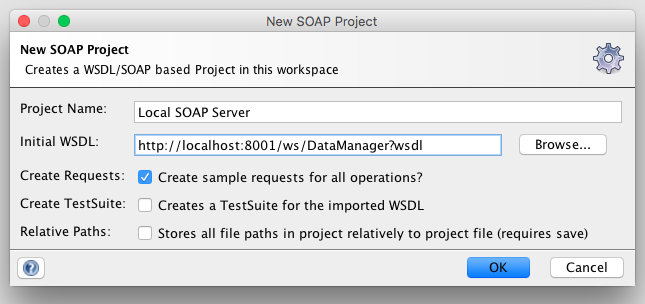
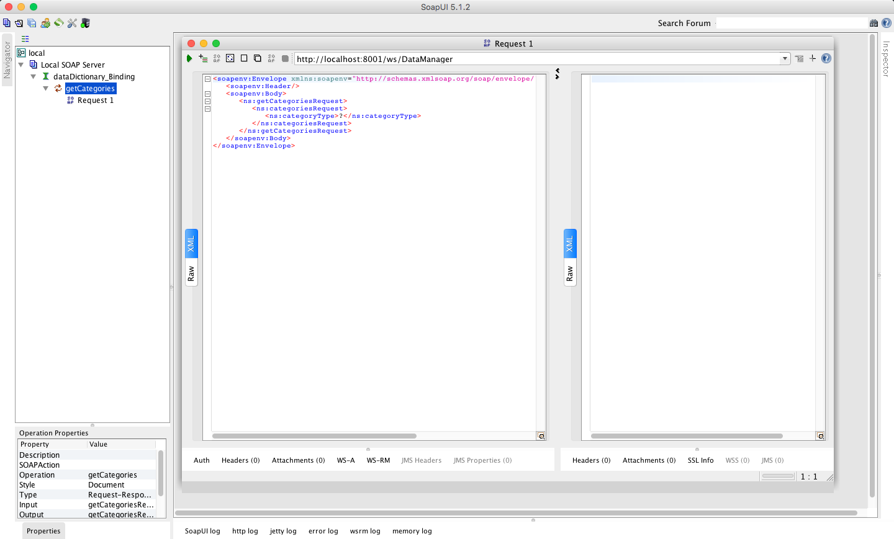
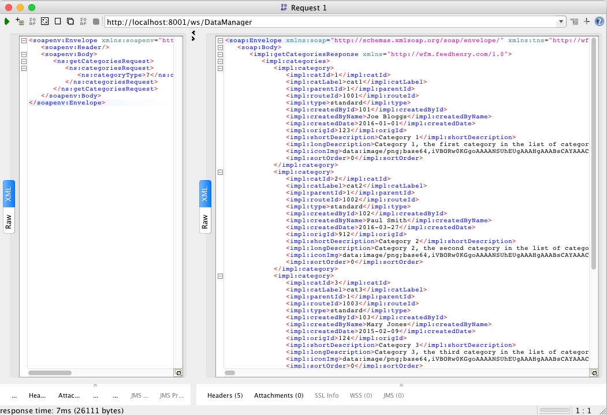

# Sample SOAP server and SOAP client (cloud app)

## SOAP Server

To start, from soapServer folder, run: "grunt serve"

This will start a simple SOAP server listening on port 8001.
To view the wsdl visit http://localhost:8001/ws/DataManager?wsdl

The provided wsdl is very simple, it exposes a single method, getCategories

To test this with soapUI,create a new SOAP project.

From the new project, navigate to dataDictionary_Binding -> getCategories -> Request 1

Click on the green play button, you should see the following response

## SOAP Client

**The SOAP Client requires redis server to be running.**

The soap client is a sample Feedhenry cloud app which connects to the running SOAP server as a client.
To start the SOAP client navigate to the soapClient folder and run "grunt serve"